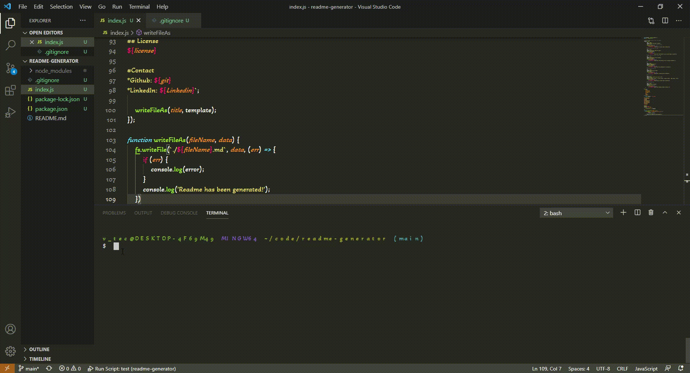

# ReadMeGenerator

## Installation
Github

## Usage
run it in your terminal

## Collaboration
Darren Watson

## Instructions
[!demo](/ GIF)

## License
The MIT License

##Contact
<ul>
  <li>*Github: Dangerousd214</li>
  <li>*LinkedIn:<a href="https://www.linkedin.com/in/darren-watson-09840b200/" target="_blank"> Darren W </a></li>
</ul>
